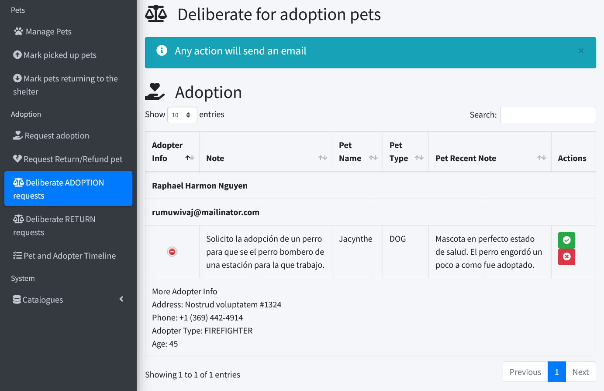

# Sistema de administración para un refugio de mascotas

Este es un proyecto hecho con:

* [Laravel 10.25.2](https://laravel.com/docs/10.x/readme)
* [Laravel-AdminLTE 3.9.2](https://github.com/jeroennoten/Laravel-AdminLTE)

Lo que hace este sistema es: dar de alta a las mascotas, solicitar una adopción y deliberar la adopcion de las mascotas.

También permite: solicitar devoluciones de mascotas, deliberar las solicitudes de devolución y marcar la acción de recogida y devolución de las mascotas al refugio.

Por último, el sistema tiene una sección donde se puede ver, por cada mascota su linea de tiempo. También por cada adoptante se puede ver su linea de tiempo.

Al deliberar la adopción o devolución de la mascota se le notifica al adoptante mediante email. 

Para mandar un email yo usé un [*Laravel Markdown Mailable*](https://laravel.com/docs/10.x/mail#generating-markdown-mailables), que después [personalicé](https://laravel.com/docs/10.x/mail#customizing-the-components).

## Ejemplo de uso para adoptar una mascota

Ir a la sección *Request adoption* y seleccionar de la lista a una mascota, después dar click en el botón de acción (columna *Actions*) para que el sistema pida la información del adoptante. El resultado al llenar el formulario es una solicitud de adopción.

## Ejemplo de deliberar una adopción

Ir a la sección *Deliberate ADOPTION requests* y seleccionar el registro que se quiere deliberar.

Al usar cualquiera de los botones de acción pedirá agregar un mensaje que se le enviará al adoptante mediante email.

## Ejemplo de marcar a una mascota como recogida

Ir a la sección *Mark picked up pets* y usar el botón de acción cuando la mascota fue recogida.

Al usar el botón de acción el sistema pedirá agregar una nota, se debe colocar obligatoriamente una observación.

## Ver la linea de tiempo de una mascota

Ir a la sección *Pet and Adopter Timeline* y en la tabla de mascotas o de adoptantes seleccionar un registro, después dar click en el botón de acción.

## License

The Laravel framework is open-sourced software licensed under the [MIT license](https://opensource.org/licenses/MIT).

AdminLTE is an open source project that is licensed under the [MIT license](https://adminlte.io/docs/3.1//license.html)
